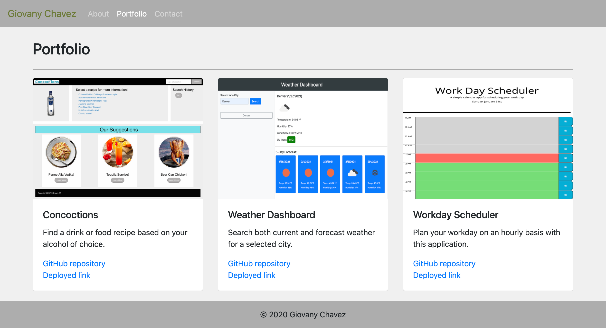

# 02-Responsive-Portfolio

This repository was created to display my current progress in learning web development and to serve as a platform to showcase my future projects on a web page.

## Overview

Being able to have others find my work in a compiled location was behind the scenes motivation, as I wanted to put my work out for others to see where I am in my web development journey and how my skills can be implemented in a professional setting. 

The website contains an about page with a short bio of myself, a portfolio page to display my future projects, and contact page if anyone desires to reach out. Using Bootstrap content to build this website, I was able to take advantage of their grid system and set columns/rows for my photos and text. This was a challenging task when trying to incorporate mobile responsive web pages. With trial and error, I learned how to do so while keeping the code condensed and easy to read.

I would like continue editing this website as I learn more about web development and update the contact page so that submissions are actually tracked. As well, I would like to replace the current photos on the portfolio page with links to projects I create.

To view the current website, please click on the following link: [Giovany's Portfolio](https://glchavez.github.io/02-Responsive-Portfolio/)

## Usage

On top of the each web page there is a navigation bar with three links: About, Portfolio, and Contact. When clicked, these links will take you to their respective web pages, as shown in the images below. On the Contact web page, you can fill out the three text boxes to submit a request for contact.

## Credits

I would like to provide credit to [The Denver Univeristy Coding Bootcamp](https://bootcamp.du.edu/coding/) for providing me with the materials and intstructions to perform this project.

Recognition is also provided to [W3Schools](https://www.w3schools.com/), [Bootstrap](https://getbootstrap.com/), and [Nu Html Checker](https://validator.w3.org/nu/) for providing me with resources to build and troubleshoot my code. 

Lastly, I would like to recognize w3newbie for their [tutorial](https://www.youtube.com/watch?v=87ONyGaOlh4) on creating a condensed dropdown navigation bar for smaller device screens.

## License

MIT License

Copyright &copy; 2020 Giovany Chavez

Permission is hereby granted, free of charge, to any person obtaining a copy
of this software and associated documentation files (the "Software"), to deal
in the Software without restriction, including without limitation the rights
to use, copy, modify, merge, publish, distribute, sublicense, and/or sell
copies of the Software, and to permit persons to whom the Software is
furnished to do so, subject to the following conditions:

The above copyright notice and this permission notice shall be included in all
copies or substantial portions of the Software.

THE SOFTWARE IS PROVIDED "AS IS", WITHOUT WARRANTY OF ANY KIND, EXPRESS OR
IMPLIED, INCLUDING BUT NOT LIMITED TO THE WARRANTIES OF MERCHANTABILITY,
FITNESS FOR A PARTICULAR PURPOSE AND NONINFRINGEMENT. IN NO EVENT SHALL THE
AUTHORS OR COPYRIGHT HOLDERS BE LIABLE FOR ANY CLAIM, DAMAGES OR OTHER
LIABILITY, WHETHER IN AN ACTION OF CONTRACT, TORT OR OTHERWISE, ARISING FROM,
OUT OF OR IN CONNECTION WITH THE SOFTWARE OR THE USE OR OTHER DEALINGS IN THE
SOFTWARE.